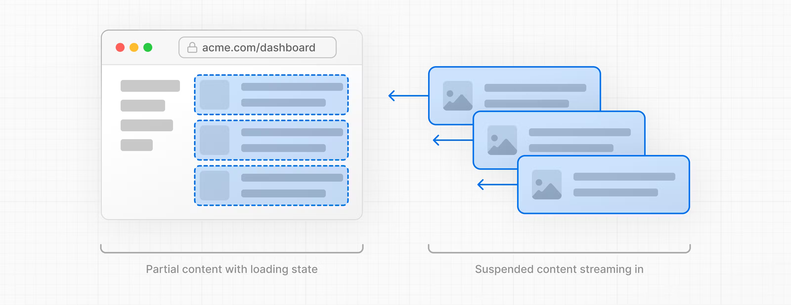
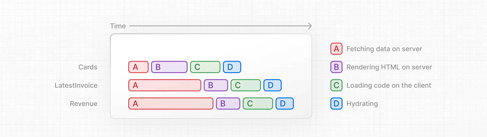
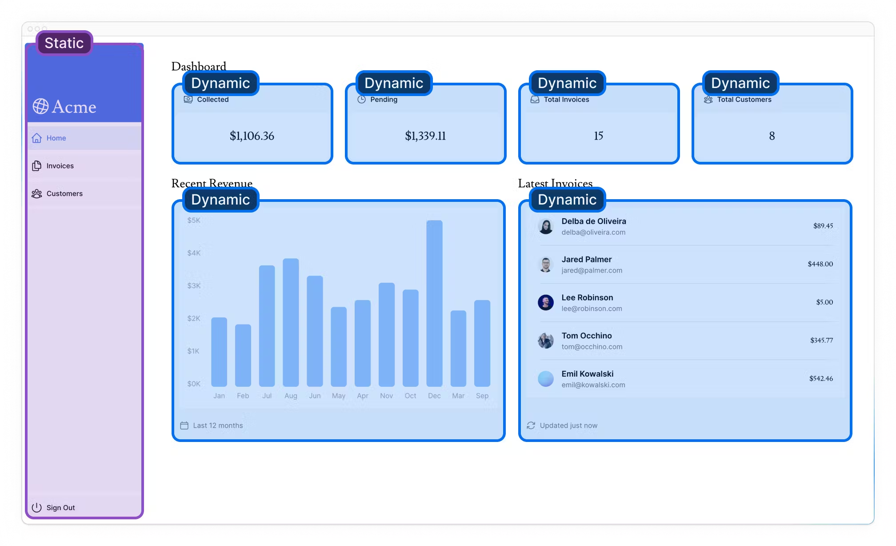
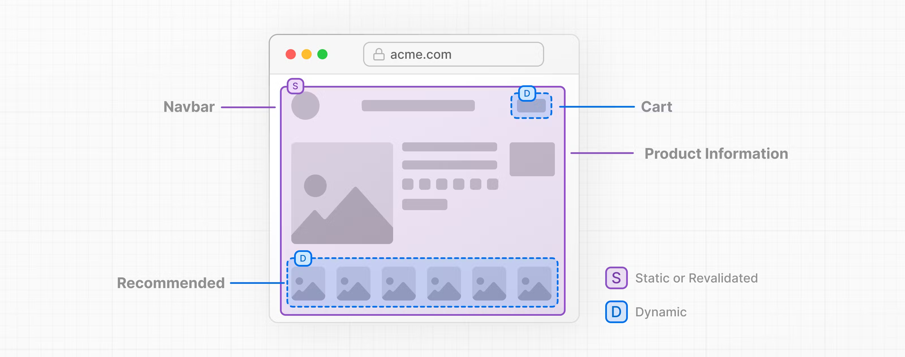

## Next.js App Router Course - Starter

This is the starter template for the Next.js App Router Course. It contains the starting code for the dashboard application.

For more information, see the [course curriculum](https://nextjs.org/learn) on the Next.js Website.

notie

## Create a Postgres database
https://nextjs.org/learn/dashboard-app/setting-up-your-database
Next, to set up a database, click Continue to Dashboard and select the Storage tab from your project dashboard. Select Connect Store → Create New → Postgres → Continue.

## Fetching Data 

Now that you've created and seeded your database, let's discuss the different ways you can fetch data for your application, and build out your dashboard overview page.

Now that you've  created and seeded your database, let's discuss the different ways you can fetch data for your application, and build our your dashboard overview  page.

## Database queries
When you're creating a full-stack application, you'll also need to write logic to interact with your database. For relational databases like Postgres, you can do this with SQL, or an **ORMhttps://vercel.com/docs/storage/vercel-postgres/using-an-orm** like  Prisma（https://www.prisma.io/）.

There are a few cases where you have to write database queries:

When creating your API endpoints, you need to write logic to interact with your database.
If you are using React Server Components (fetching data on the server), you can skip the API layer, and query your database directly without risking exposing your database secrets to the client.

When  creating your API endpoints, you need to write logic to interact with your database.
If you are using React Server Components (fetching data on the server), you can skip the API layer, and query your database directly without risking exposing your database secrets to the client.

That's right, you should not query your database directly when fetching data on the client as this would expose your database secrets.
That's right, you should not query your database directly when fetching data on the client as this would expose your database secrets.

## Using SQL
For your dashboard project, you'll write database queries using the Vercel Postgres SDK and SQL. There are a few reasons why we'll be using SQL:

For your dashboard project, you'll write database queries using the Vercel Postgres SDK and SQL. There are a few reasons why we'll be using SQL:

## Static and Dynamic Rendering
https://nextjs.org/learn/dashboard-app/static-and-dynamic-rendering

## What is Dynamic Rendering?
With dynamic rendering, content is rendered on the server for each user at request time (when the user visits the page). There are a couple of benefits of dynamic rendering:
With dynamic rendering ,your application is only as fast as your slowest data fetch.

## Streaming
In the previous chapter, you made your dashboard page dynamic, however, we discussed how the slow data fetches can impact the performance of your application. Let's look at how you can improve the user experience when there are slow data requests.
Streaming is a data transfer  technique that allows you to break down a route into smaller "chunks" and progressively stream them from the server to the client as they become ready.

## 10: Partial Prerendering (Optional)

The <SideNav> component doesn't rely on data and is not personlized to the user, so it can be static.
The components in <Page> rely on data that changes often and will be personalized to the user, so they can be dynamic.

What is Partial Prerendering?
What is Partial prerendering?
Next.js 14 contains a preview of Partial Prerendering - an experimental feature 
that allows you to render a route with a static loading shell,while keeping some parts dynamic . In other words, you can isolate the dynamic parts of a route. For  example:

Partial Prerendering
https://nextjs.org/learn/dashboard-app/partial-prerendering

## Chapter 12 Mutating Data

GOOD TO KNOW: IN HTML, you'd pass a URL to the action attribute. This URL  would be the destination where your form data should be submitted (usually an API endpoint).
However, in React, the action attribute is considered a special prop - meaning React builds on top of it to allow actions to be invoked. 
Behind the scenes, Server Actions create a POST API endpoint . This is why you don't need to create API endpoints manually when using ServerActions.

Right now, we're not handling any errors. We'll do it in the next chapter. For now, let's move on to the next step.
Right now, we're not handling any errors. We'll do it in the next chapter. For now, let's move on to the next step.

## Further reading 
In this chapter, you learned how to use Server Actions to mutate data. You also learned how to use the revalidatePath API to revalidate the Next.js cache and redirect to redirect the user to a new page.
mutate data mutate data \

## Handling Errors
Handling Errors
In the previous chapter, you learned how to mutate data using Server Actions. let's see how you can handle errors gracefully using JavaScript's try/catch statements and Next.js APIs.

## Improving Accessibility
https://nextjs.org/learn/dashboard-app/improving-accessibility

If you'd like to learn more about accessibility, we recommend the Learn Accessibility course by 
web.dev.（https://web.dev/）
## Adding Authentication
https://nextjs.org/learn/dashboard-app/adding-authentication

update the key in production enviroment:https://vercel.com/docs/projects/environment-variables

## Adding Metadata
https://nextjs.org/learn/dashboard-app/adding-metadata
Metadata is crucial for SEO and shareability. In this chapter, we'll discuss how you can add metadata to your Next.js
application.

finish：
Here are some resources to continue exploring Next.js:

Next.js Documentation
Next.js Templates:
Admin Dashboard Template
Next.js Commerce
Blog Starter Kit
Nextra: Docs Starter Kit
Image Gallery Starter
Next.js Repository
Vercel YouTube
Next.js App Router: Routing, Data Fetching, Caching
Performance in React and Next.js (Lydia Hallie)
Vercel Product Walkthrough